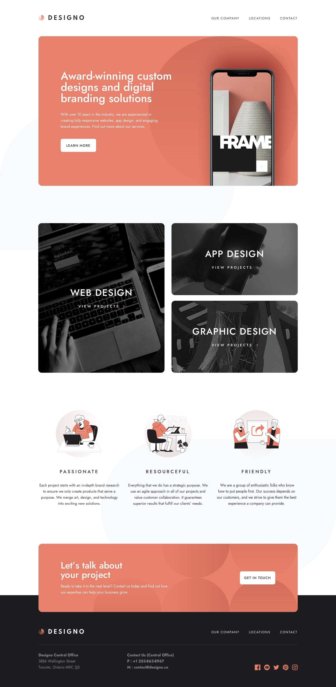

# Designo Agency website

Multipage website of Designo Agency.

## Table of contents

- [Overview](#overview)
  - [Links](#links)
- [My process](#my-process)
  - [Built with](#built-with)
  - [What I learned](#what-i-learned)
  - [Continued development](#continued-development)
- [Author](#author)

## Overview

### Links

- Solution: [https://github.com/chamanbravo/Designo-website](https://github.com/chamanbravo/Designo-website)
- Live Site: [https://designoagency.vercel.app](https://designoagency.vercel.app/)

## My process

### Built with

- Semantic HTML5 markup
- CSS custom properties
- Flexbox
- CSS Grid
- Mobile-first workflow
- Vanilla JavaScript
- Google Maps

### What I learned

- Using Mobile-first workflow makes this much easier.

### Continued development

Now I am planning on learning React and start applying it in my projects as well. 😃

## Author

- [Chaman Bravo](https://http://chamanbudhathoki.com.np/)

